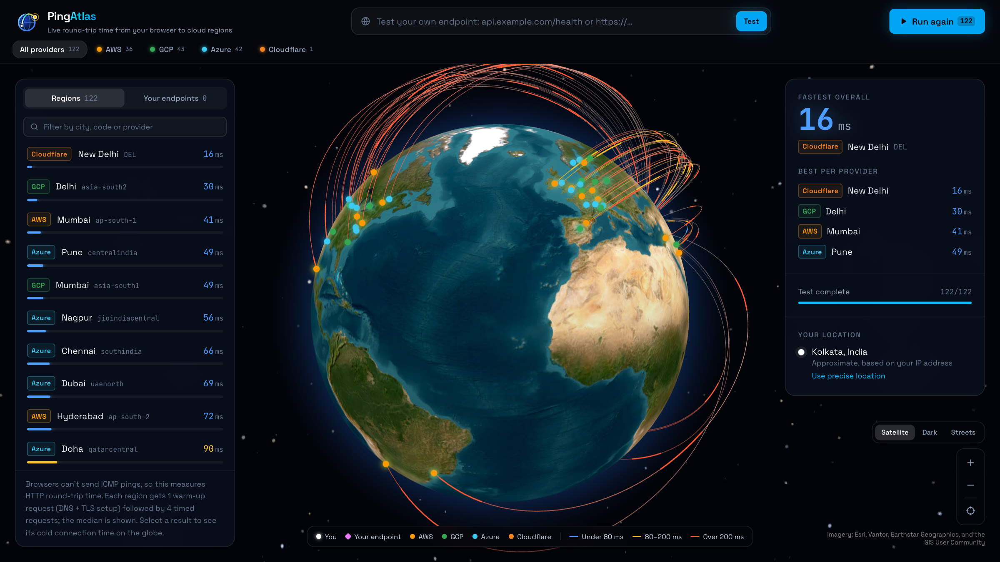
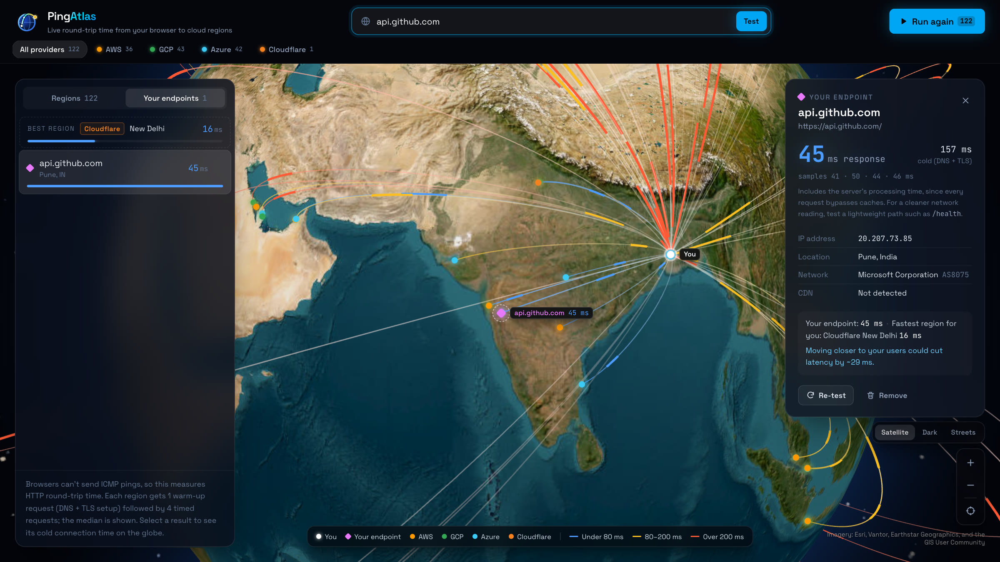

<p align="center">
  
</p>

<h1 align="center">PingAtlas</h1>

<p align="center">
  <strong>Live cloud latency from your browser, on a 3D globe.</strong><br />
  Measure · Visualize · Deploy smarter
</p>

<p align="center">
  <strong>Live demo:</strong> coming soon ·
  <a href="#how-it-measures">How it measures</a> ·
  <a href="#getting-started">Run it locally</a>
</p>



PingAtlas measures round-trip time from your browser to **122 cloud regions**: 36 AWS, 43 Google Cloud and 42 Azure
regions, plus your nearest Cloudflare edge. Each result lands on an interactive globe the moment it arrives, so you can
see which region is actually fastest from where you are, and how your own servers compare.

## Features

- **Live multi-cloud test.** Results stream onto the globe and into a list sorted fastest first. Stop and re-run at any
  time, or test one provider at a time with the filters.
- **A real, zoomable globe.** Satellite, dark and street maps that sharpen as you zoom, down to street level. Arcs are
  colored by latency, and the packets travelling along them move faster on quicker routes.
- **Fastest region and best per provider**, always on screen.
- **Test your own endpoint.** Enter a URL or domain to get its response time (median and cold connection), where it's
  hosted, who runs the network, whether it's behind a CDN, and how it compares with the fastest cloud region near you.
  Up to 8 endpoints are saved so you can compare them side by side.
- **Your location** comes from browser geolocation if you allow it, otherwise from your IP address.
- **Respects reduced motion.** Animations turn off when your system asks for less motion.



## How it measures

Browsers can't send ICMP pings, so PingAtlas times HTTP round trips with `fetch()`:

1. Requests use `mode: "no-cors"`, `cache: "no-store"`, no credentials, and a unique query parameter, so nothing is
   ever answered from a cache.
2. One **warm-up** request per target opens the connection (DNS + TCP + TLS). Its time is shown as the **cold**
   connection time.
3. Four **timed** requests then reuse that connection. Their **median** is the reported latency.
4. Up to four targets are measured at once, with a 5-second timeout per request.

Latency colors: **blue** under 80 ms, **amber** 80–200 ms, **orange-red** over 200 ms.

| Provider     | Regions | What gets timed                                                                   |
| ------------ | ------: | --------------------------------------------------------------------------------- |
| AWS          |      36 | DynamoDB's health check, `https://dynamodb.<region>.amazonaws.com/ping`           |
| Google Cloud |      43 | [gcping.com](https://gcping.com)'s Cloud Run service in each region               |
| Azure        |      42 | Azure AI Services' regional host, `https://<region>.api.cognitive.microsoft.com/` |
| Cloudflare   |       1 | `cdn-cgi/trace` on your nearest edge (Cloudflare is anycast)                      |

**Good to know**

- After the warm-up, the numbers are close to network round-trip time plus a few milliseconds of HTTP overhead.
- **Custom endpoints report response time**, which includes the server's processing time, because every request
  bypasses caches. Test a lightweight path such as `/health` for a cleaner network reading.
- Region coordinates are approximate: providers don't publish exact data-center locations.
- Measurements run on your browser's main thread alongside the globe, so a heavily loaded machine can inflate them.

## Getting started

Requires **Node.js 20.19+ or 22.12+**.

```bash
git clone https://github.com/keshavkumar143/Latency-globe.git
cd Latency-globe
npm install
npm run dev
```

Then open http://localhost:5173 and press **Run test**.

| Command                     | What it does                                         |
| --------------------------- | ---------------------------------------------------- |
| `npm run dev`               | Start the dev server                                 |
| `npm run build`             | Build static files into `client/dist/`               |
| `npm run lint`              | Run ESLint                                           |
| `npm run format`            | Format with Prettier (`format:check` to verify only) |
| `npm run preview -w client` | Serve the production build locally                   |

PingAtlas runs entirely in the browser, so the build output can be deployed to any static host.

## Configuration

- **Azure targets:** `client/src/config/azureEndpoints.js` lets you swap a region's default target for your own storage
  blob URL.
- **Measurement settings, thresholds, colors and URLs** live in `client/src/constants/`, grouped by topic.
- **Map styles:** `client/src/constants/mapStyles.js`.
- **Adding a provider:** add it to `constants/providers.js` and its regions to `data/regions.json`, then add a target
  builder in `services/targets/`.

## Privacy

There's no backend: nothing is sent to or stored on a PingAtlas server. To work, your browser contacts:

- the cloud endpoints being measured;
- [get.geojs.io](https://www.geojs.io/) or [ipwho.is](https://ipwho.is/) to estimate your location from your IP (skipped
  if you've allowed precise location);
- Cloudflare DNS-over-HTTPS and ipwho.is, only when you test a custom endpoint;
- Esri for map tiles and Google Fonts for typefaces.

Saved endpoints and your map style are kept in your browser's local storage.

## Project structure

```
client/src/
├── app/          Wires the features together: layout, panels, selection
├── features/     latency-test, globe, endpoints, location
├── components/   Shared UI (buttons, panels, latency bars, logo)
├── services/     Network and browser APIs: measurement, targets, DNS, IP lookup
├── constants/    Every tunable value, color and URL
├── config/       Settings you're expected to edit (Azure overrides)
├── data/         Region catalog, GCP endpoint and Cloudflare location snapshots
└── hooks/ · utils/ · styles/
brand/            Logo source
docs/             Screenshots
```

Architecture notes and code conventions are in [CLAUDE.md](CLAUDE.md).

## Tech stack

React 19 · Vite 8 · Tailwind CSS 4 · three.js with [react-globe.gl](https://github.com/vasturiano/react-globe.gl) ·
[Motion](https://motion.dev)

## Roadmap

- [ ] Server-side endpoint inspection: response headers, TLS certificate, and exact provider region from published IP
      ranges
- [ ] Undersea cable layer
- [ ] Crowd-sourced latency heatmap
- [ ] "Where should I deploy?" recommendations based on where your users are
- [ ] Shareable results card

## Credits

- Map imagery: Esri, Vantor, Earthstar Geographics, and the GIS User Community. Map data: Esri, HERE, Garmin, USGS,
  © OpenStreetMap contributors.
- GCP endpoints from [gcping](https://github.com/GoogleCloudPlatform/gcping). Cloudflare edge locations from
  [speed.cloudflare.com](https://speed.cloudflare.com).
- Globe rendering by [globe.gl](https://github.com/vasturiano/globe.gl).

Feedback, issues and pull requests are welcome.
